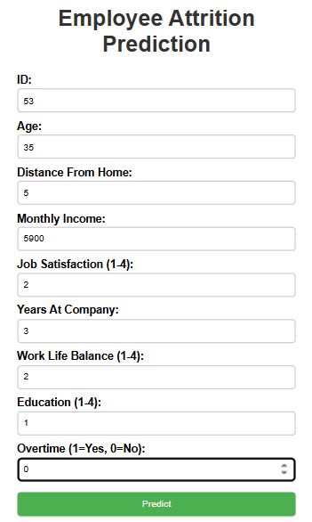

# Employee Attrition Prediction Model

This project is a **Machine Learning-based Prediction System** that predicts whether an employee is likely to leave the company based on various workplace and demographic factors.  
The model uses a **Logistic Regression** algorithm to classify employees as either staying (`No`) or leaving (`Yes`), and it is deployed via a Flask web application.

---

## Features
- Predict employee attrition from multiple HR and personal metrics.
- Clean and organized code structure.
- Trained using **Logistic Regression** for binary classification.
- Flask web interface for interactive predictions.
- Model stored using **pickle** for reusability.

---

## Project Structure
```
EmployeeAttrition-Prediction/
│
├── model.py                  
├── app.py                   
├── templates/
│   ├── index.html            
│   └── result.html           
├── static/
│   └── style.css             
├── employee_attrition.csv    
├── attrition_model.pkl       
├── README.md                 
└── requirements.txt          
```

---

## Installation
1. Clone the repository:
   ```bash
   git clone https://github.com/harshini202005/LogisticRegression.git
   cd LogisticRegression
   ```

2. Install dependencies:
   ```bash
   pip install -r requirements.txt
   ```

---

##  Dataset
The dataset contains the following columns:
- **ID**: Employee ID  
- **Age**: Age of the employee  
- **DistanceFromHome**: Distance from home to work (in km)  
- **MonthlyIncome**: Monthly salary of the employee  
- **JobSatisfaction**: Job satisfaction score (1–4)  
- **YearsAtCompany**: Number of years the employee has worked in the company  
- **WorkLifeBalance**: Work-life balance score (1–4)  
- **Education**: Education level (1–4)  
- **Overtime**: Whether the employee works overtime (Yes/No)  
- **Attrition**: Target variable — whether the employee will leave the company (Yes/No)  

---

## Model Training
Run the following command to train and save the model:
```bash
python model.py
```
This will:
- Load and preprocess the dataset.
- Convert categorical variables into numeric form.
- Train the **Logistic Regression** model.
- Save the trained model as `attrition_model.pkl`.

---

## Running the App
Start the Flask server:
```bash
python app.py
```
Open your browser and go to:
```
http://127.0.0.1:5000
```

---

## Screenshots


---

## Requirements
- Python
 3.8+
- Flask
- Pandas
- NumPy
- Scikit-learn
- Matplotlib
- Seaborn

Install all dependencies using:
```bash
pip install -r requirements.txt
```

--
##  Deployment
[Live Demo](https://logisticregressor.onrender.com/)


